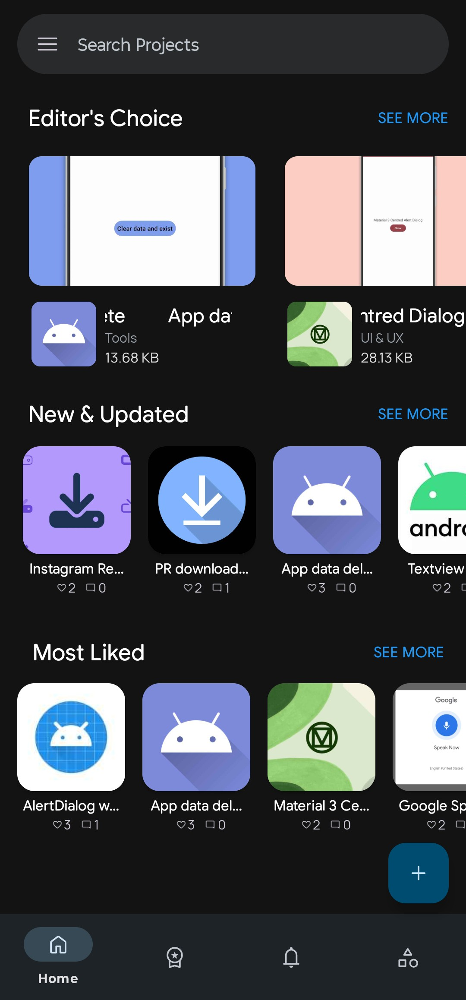
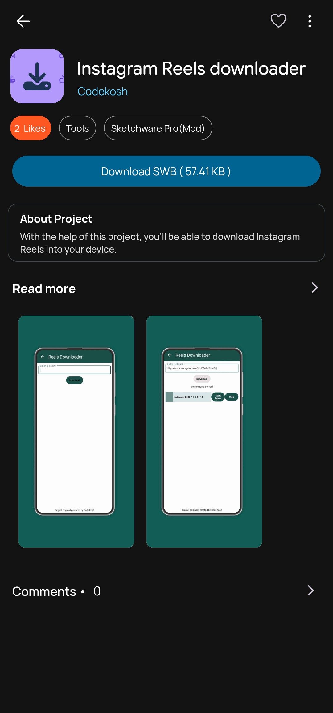
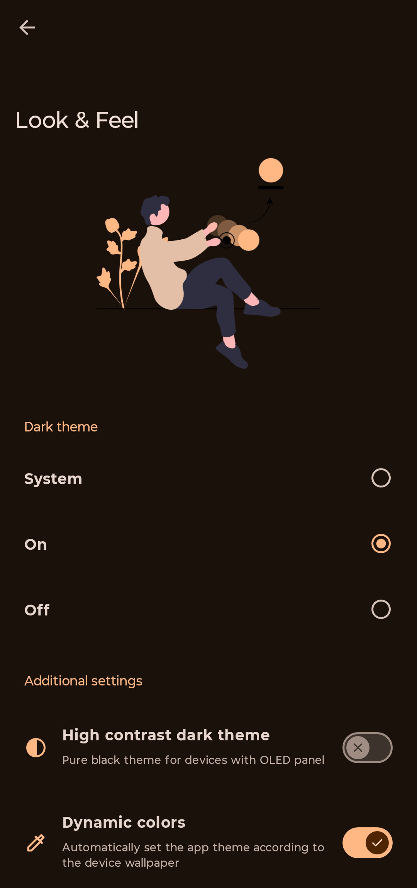

<!-- PROJECT HEADER -->
<h1 align="center">🌟 OpenWare</h1>
<h3 align="center">A Modern App Store for Open-Source Android Apps</h3>

<p align="center">
  
  
  
</p>

<p align="center">
  <i>A Material Expressive, privacy-first, open-source discovery platform — crafted for developers & curious explorers.</i>
</p>

---

## ✨ What is OpenWare?

**OpenWare** is a clean, modern, Material Expressive Android app store crafted exclusively for open-source apps.  
Fast. Elegant. Privacy-respecting. No ads. No tracking. Only open-source goodness.

It brings together scattered open-source Android projects into one beautifully designed, community-driven home.

---

## 🎨 Features That Shine

- ✨ **Material Expressive UI** — dynamic color, smooth motion, soft shapes  
- 🔍 **Smart Search** — find apps instantly  
- 📦 **GitHub-Powered** — reads releases, metadata & changelogs automatically  
- 📥 **Direct APK Install** — downloads from verified GitHub releases  
- 🔐 **Privacy-First Design** — absolutely no analytics or tracking  
- 📝 **Rich App Pages** — screenshots, contributors, licenses & more  
- ⚡ **Super Optimized** — Compose-first architecture for speed  

---

## 🖼 Screenshots

<p align="center">
  
  
  
</p>

---

## 🧩 Tech Stack

| Component   | Technology |
|-------------|------------|
| Language    | **Kotlin** |
| UI          | **Material 3 + Material Expressive** |
| Networking  | **Firebase + Coroutines** |
| Media       | **Coil** |

---

## 🚀 Getting Started

Clone the repository:

```bash
git clone https://github.com/meashutoshhoon/OpenWare.git
